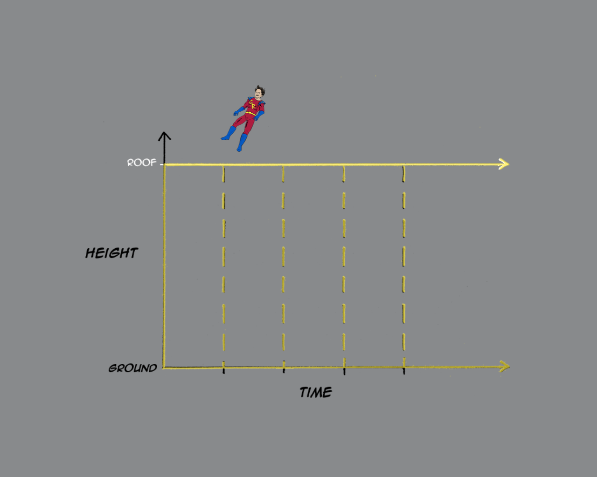
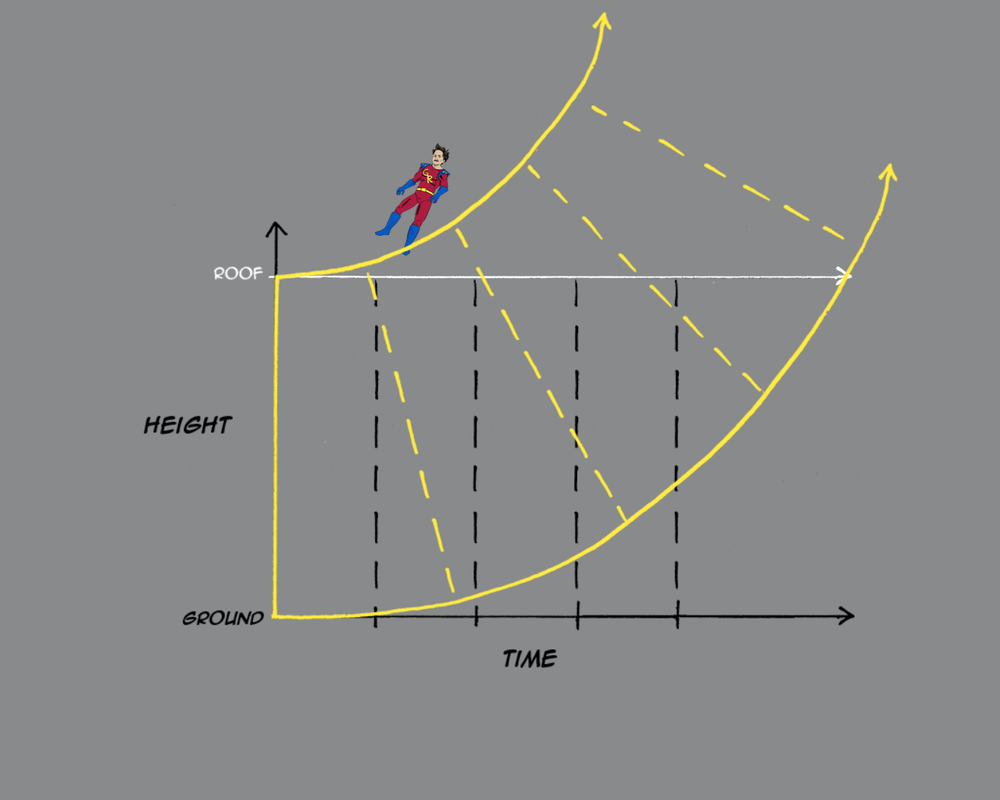

# Black Holes

## 0. Prepare for the big moment

- 1054: SN 1054 - Crab Nebula
- 1676: First measure the speed of light
- 1783: definition of dark star - escape velocity > speed of light

## 1. Relativity

- Special Relativity (1905)
- General Relativity (1915)

### 1.1. Special Relativity Foundations

- Inertial frame of reference (with no acceleration)
- Speed of light is absolute/invariant

### 1.2. Special Relativity Consequences

- E=mc2
- Time dilation
- 2D quantified spacetime (double light cone)
- (it doesn't care about gravity)

### 1.3. General Relativity Foundations

- 3D quantified spacetime
- it really cares about gravity

### 1.4. General Relativity Consequences

- Equivalence Principle Experiments:
  - Philoponus (6th century): two balls with different weights fall the same speed
  - Newton (~1680): period of pendulum with different masses but identical length
  - David Scott (1971): drop feather and hammer on the Moon
- Gravitational Lensing
- Gravitational Waves
- BLACK HOLES (FINALLY...)

## 2. Paradox - The Fuel of Physics

- Newton's First Law: Uniform Motion
  - No Motion (No Force)
  - Constant Speed
- Paradox: jump off the roof
  - No Force (but I accelerate)
- Solution: warped spacetime (3D)
- Explain:
  - turn off gravity:
    - floating a straight line

  - turn on gravity: gravity wraps spacetime
    - fall to the ground (as expected)
    - time ticks slower on the ground than on the roof

## 3. Solution of the General Relativity (1916)

- Schwarzschild found his radius
- BLACK HOLES (FINALLY AGAIN...)

## 4. Bald Black Holes

- No-hair Theorem
- Three properties:
  - mass
  - electric charge
  - angular momentum
- Physics meme exists

## 5. Black Hole Behaviour

- Physical property
  - Micro: mass of the Moon with ~0.1mm radius
  - Stellar: 10 x mass of the Sun with 30km radius
  - Intermediate-mass: 1000 x  mass of the Sun with 1000 km radius (Earth radius: 6378km)
  - Supermassive: 100000 to 10 billion x  mass of the Sun with 0.001-400 AU (Astronomical unit: Sun Earth distance: 150 million km)
- Singularity
  - Spaghettification

- ISCO
- Photonsphere
- Ergosphere
- Event Horizon

## 6. Observe Indirectly

- intense light coming from accretion disk
  - ISCO (Innermost Stable Circular Orbit)
    - ISCO > R: accretion disk spin the same direction as the black hole
    - ISCO = 3R: the black hole is not rotating
    - ISCO < 9R: accretion disk spin the inverse direction as the black hole

- SMBH affecting near stars

[Stars orbiting around supermassive black hole at the center of the Milky Way](https://upload.wikimedia.org/wikipedia/commons/7/71/Simulation_of_the_orbits_of_stars_around_the_black_hole_at_the_centre_of_the_Milky_Way.webm)
- Gravitational Lensing

- Gravitational Waves
  - LIGO

  
  - VIRGO

  
- Take a photo

- Hawking radiation

## 7. Nobel Prize
- 2017: LIGO
- 2020: Penrose, Ghez, Genzel

## 8. Paradox Again
- general relativity and quantum mechanics fight against each other
- quantum mechanics doesn't allow information loss in the system, so what happens in the black hole?

## 9. References
- [Simple example about the general relativity](https://vis.sciencemag.org/generalrelativity/)
- [AtomCsill presentation about the black holes](https://youtu.be/rToQgaiMy4M)
- [Nobel Prize 2017](https://www.nobelprize.org/prizes/physics/2017/summary/)
- [Nobel Prize 2020](https://www.nobelprize.org/prizes/physics/2020/summary/)
- [LIGO](https://www.ligo.caltech.edu/)
- [VIRGO](https://www.virgo-gw.eu/)
- [Cygnus X-1](https://en.wikipedia.org/wiki/Cygnus_X-1)
- [03.2022. - Black Holes may have quantum hair?](https://www.livescience.com/black-hole-quantum-hair)
- [Black Holes - Wikipedia](https://en.wikipedia.org/wiki/Black_hole)
- [Spaghettification - Wikipedia](https://en.wikipedia.org/wiki/Spaghettification)
