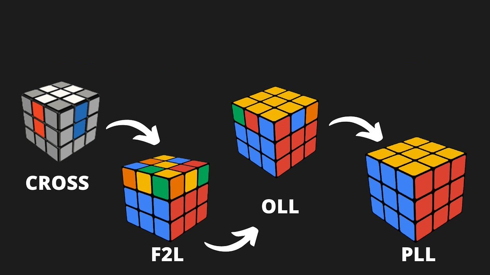

# Rubik's Cube

## 1. History
- Inventor: Ernő Rubik (scrulptor, *real* architect)
- Invented: 1974
- Original name: Magic Cube
- Original colors: white, blue, red, orange, green, yellow

## 2. Pop Culture Icon
- 1980: International debut as Rubik's Cube
- 1980: Toy of the Year - Best Puzzle [Germany, UK, France, US]
- 1981: Game of the Year - Best Puzzle [Finland, Sweden, US]
- 1981: Patrick Bossert - You Can Do the Cube [13 years old wrote a solution guide]
- 1982: MOMA NY selected Rubik's Cube into its permanent collection
- 2005: 25 years of the Rubik's Cube - 3rd World Championship

## 3. Some Statistics
- 1980-1983: 200 million cubes sold
- 2021: 450 million cubes sold
- 2023: 500 million cube sold
- best selling puzzle worldwide
- best selling toy worldwide
- most expensive: Masterpiece Cube - $2.5 million

 

 

## 4. First Rubik's Cube World Championship
- 1982 - Budapest
- 19 countries
- the first official speedcubing championship
- 1st place: Minh Thai [US] - 22.95s
- 3rd place: Zoltán Lábas [HU] - 24.49s
- 17th place: Piotr Serbenski [PL] - 37.50s
- 18th place: Svilen Tenev [BG] - 47.29s
- 19th place: Josef Trajber [AT] - 50.16s

## 5. Cube Math
- The 3x3x3 has a lot of possible patterns: 43.252.003.274.489.856.000 (43 quintillion - 43 * 1018)
- Computer can solve in [20 moves (God's number)](https://cube20.org/)
- Humans usually solve in 50-60 moves

## 6. Revolution of Speedcubing
- 1997: Jessica Fridrich invented CFOP
- C: Cross
- F: F2L (First 2 layers)
- O: OLL (Orient last layer)
- P: PLL (Permutate last layer)

 

 

## 7. Big Four
- 1981: Petrus (1st WC - 4th place) ~ 45-50 average move count
- 1997: CFOP ~ 55-60 average move count
- 2003: Roux ~ 45-50 average move count
- 2006: ZZ 45-55 average move count
- lower move count&#8800faster

## 8. CFOP Again
- C: average 6, max 8 moves
- F: average 4*7 moves
- O: 57 algorithms
- P: 21 algorithms

## 9. Notation
- FRULBD
- F'R'U'L'B'D'
- F2...
- 3rd OLL alg: L shape - L'B'LR'U'RUL'BL

## 10. Speedcubing Milestones
- 1982: Minh Thai - 22.95s
- 2005: Jeans Pons - 15.10s
- 2015: First Sub-5 Lucas Etter - 4.90s
- 2018: Yusheng Du - 3.47s
- 2023: Max Park - 

## 11. Cube Championships
- from 2003 Cube Championship happens in every 2 years
- speed
- fewest moves
- blindfolded
- one handed (speed alternative)
- with feet

## 12. Top Speedcubing Brands
- GAN
- MoYu
- Tornado
- Rubik's
- and many more...
