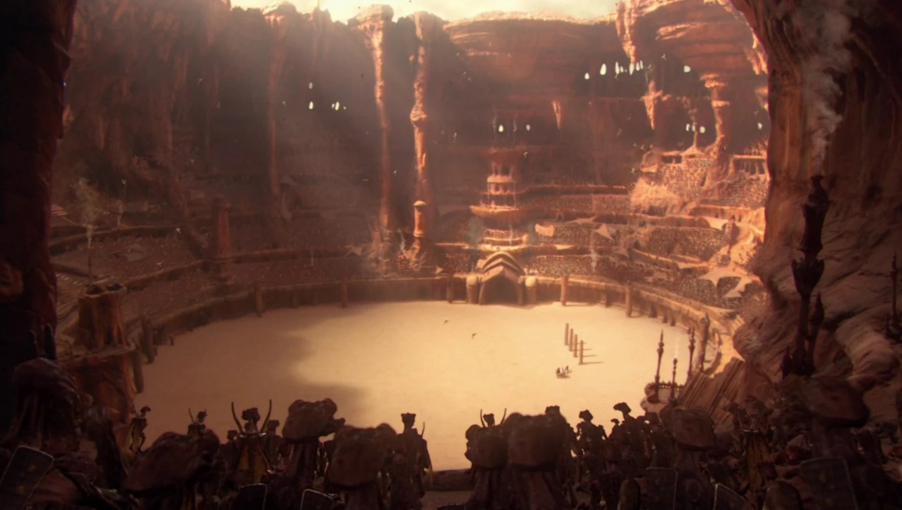
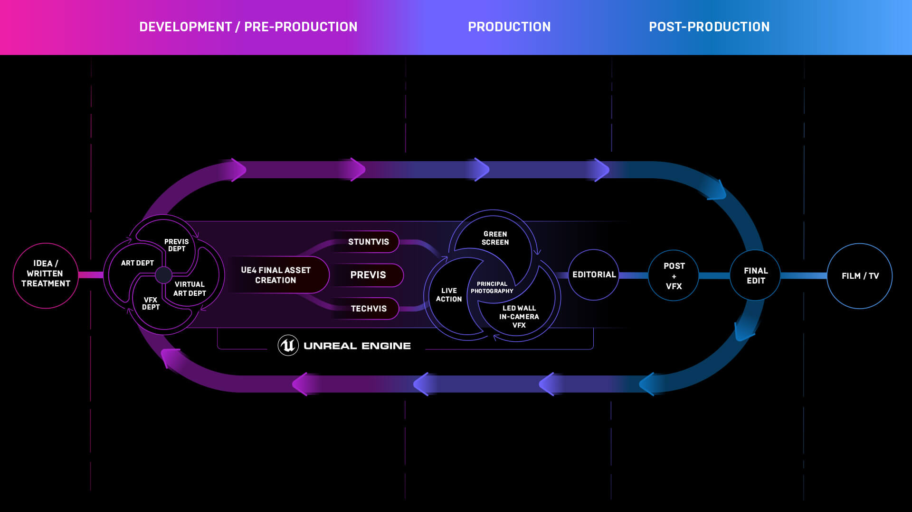

# Effects in Motion Pictures

## 1. AH (Abbrev Hell)
- CG: computer graphics
- CGI: computer generated imagery
- SFX: special effects
- VFX: visual effects

## 2. Film Production Phases
- Pre-production
- Production
- Post-production

### 2.1. Pre-Production
- concept art
- previs

### 2.2. Production
- analog/digital camera recording

### 2.3. Post-Production
- cut
- VFX

## 3. VFX Companies
- [Industrial Light & Magic](https://www.ilm.com/): *Star Wars: Episode IV - A New Hope*
- [Wētā FX](https://www.wetafx.co.nz/): *The Lord of the Rings: The Fellowship of the Ring*
- [Scanline VFX](https://www.scanlinevfx.com/reels/): *300*
- [Digital Domain](https://digitaldomain.com/): *Titanic*
- [DreamWorks Animation](https://pibfyc.dreamworks.com/?slug=videos&type=page&id=242): *Shrek*
- [Pixar Animation Studios](https://www.pixar.com/feature-films-launch): *Toy Story*
- [Walt Disney Animation Studios](https://disneyanimation.com/): *Mickey Mouse & Friends*

## 4. Who is Adam "MythBusters" Savage?

## 5. Visual Effects
- SFX: on set, physical based
- Motion capture: movement recording
- Matte painting: static landscape/environment
- Animation: digital movement creation
- 3D modeling: virtual actor, digital double
- Rigging: skeletal animation
- Rotoscoping: frame-by-frame cutout
- Chroma key: blue/green screen
- Match Moving: insertion of CG into live-action footage
- Compositing: combining multiple source of visual elements into single image
- Digital Effects: simulations - fire, smoke, water

## 6. Visualization - Pre-Production
- [The Third Floor](https://thethirdfloorinc.com/reels/#highlights)

## 7. Virtual Production
- GOT: [Game of Thrones Virtual Production with Unreal Engine](https://www.unrealengine.com/en-US/spotlights/virtual-production-on-the-battlegrounds-of-game-of-thrones)
- Unreal Engine Virtual Production Flow

- ILM: [StageCraft](https://www.ilm.com/stagecraft/)

## 8. Film Stock
- [Kodak EKTACHROME 5294 - Euphoria S2](https://www.kodak.com/en/motion/blog-post/euphoria)

## 9. Misc Examples

[Blade Runner Opening Scene - Hades landscape](https://youtu.be/nFVcdKa0M9E)

  
  

## 10. VFX Tools
- Maya, Cinema4D, 3Ds Max, Blender
- ZBrush
- Substance Designer, Substance Painter
- Photoshop
- After Effects
- Houdini
- Nuke
- Unreal Engine, Unity

## 11. Low-Budget Approach - Blender Only
- Ian Hubert - Dynamo Dream Series {[1](https://youtu.be/LsGZ_2RuJ2A),[2](https://youtu.be/xlqhdaLhRVY),[3](https://youtu.be/JM_WPiT6NRQ)}
- [Dynamo Dream Teaser Breakdown](https://youtu.be/FFJ_THGj72U)
